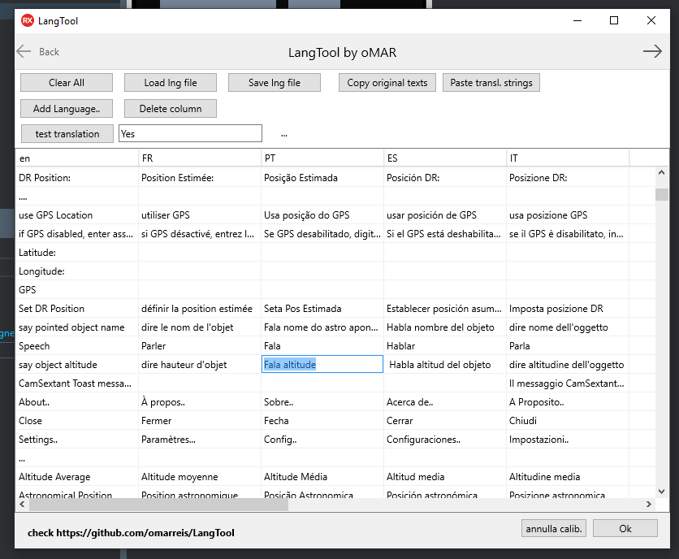

# LangTool
This app offers some features not found in the original TLang IDE editor.

LangTool is a Firemonkey app (multiplatform). Tested on Windows 10.
Compiled with Delphi 10.3.3

## LangTool  features :
* Load/Save *.LNG files 
* Edit all languages in the same grid (uses a TStringGrid, edit strings in place)
* Copy original list of texts to clipboard (f.e. to use with Google Translate) 
* Paste list of strings from clipboard (input translation results). 
  Before pasting a list of strings from clipboard **place the cursor in the desired cell** 
  Place cursor in the top of the column to paste a new language
  
Note that automatic translation services a lot of times translate words out of context.
Have a translator - or at least a native speaker - review your app translations.

Interaction between LangTool and TLang is done by means of LNG files.

* On the IDE, double click TLang component to open property editor
* Import texts from form (labels buttons etc)
* Save file *.lng*. No languages yet.
* Open the file with LangTool
* Add languages using 2 letter codes like 'ES', 'FR', 'IT' .. 
* Complete translation texts, editing grid cells ( in plkace editing). 
Leave untranslated texts empty. 
* Save *.lng file
* On the IDE, TLang property editor, load translation file.

TLang is a work in progress (D 10.3.3)  The original editor has no way 
to delete a single language. If you open the lng file 
on top of existing translations, they get duplicated.

To work around that, what I did was:

* In your app , right-click the form change form-to-text 
* Locate TLang component (f.e. Lang1) delete ResourcesBin property 
* change back to form, double click the empty TLang and import the file edited with LangTool (*.lng)
* close TLang editor and reopen it to update the languages combo (it is not updated after load)

TODO: Localize LangTool !!!!   :)

You may also need to localize Delphi default dialog texts ( Yes, No etc). This is not done by TLang.
To do that copy FMX.Dialogs.pas to project directory and change it 
as described in this stackoverflow answer (the one by omarreis)

https://github.com/omarreis/LangTool/blob/master/fixDialogs.md

https://stackoverflow.com/questions/39750219/how-to-change-at-runtime-the-value-of-smsgdlgyes-smsgdlgno-etc/61643607#61643607

