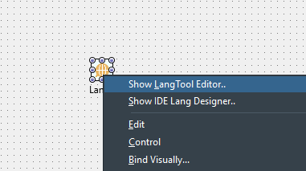
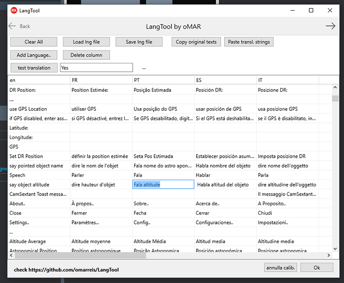

# LangTool

## tl;dr - Alternative TLang component editor, to maintain app language translations.

LangTool is a language editor for Delphi Firemonkey, to help with app localization.

It manages LNG ( language files ) to be used with component TLang.
TLang is FMX library languages container. It has a custom component editor.
This package offers complementary features, not present in the original TLang editor.

To localize your app, add a *TLang* component to the form. It will manage the language translations.
Right-Click TLang to open component editor. TLang imports texts from the form(s).

* TLang translates all form Texts at startup, when component style is rendered. 
* Translate() function is used by many FMX components when rendering ( TLabel, TEdit, TMemo..)
* When loaded, TLang copies translation resources to a global var, which FMX uses to access translations from multiple files.
* Use Translate() func to translate texts at run time.

## Project News  
* feb/21: It seems TLang component is *deprecated* from D10.4.2+, along with VCL integrated localization. It works for now, but will be no longer supported by EMB. 
* mar/22: Delphi 11 deprecated TLang (Mar/22). Working ok on D10.4.2.
* Mai/22: Tested ok with D11.1 Alexandria. *TLang* is no longer supported but the code is still there :)  

## LangTool as design package
LangTool can be installed as a design time package on the Delphi IDE. 
The IDE package contains no new components, only an alternative TLang Component Editor.
LangTool allows IDE integrated translation  work ( human or otherwise )

* open dclLangTool.dpk. Build and install the package.  

When you install *LangTool* package aparently nothing happens. No component is added.
To see LangTool in action:

 * create a Firemonkey Form 
 * add a TLang component 
 * right-click the component. LangTool editor appears in the Edit menu ( see image ).

 

## LangTool as a WIndows desktop app
Langtool can be compiled as a standalone executable (single file Win32 application). It can be sent to a human translator along with the .LNG file. 
The translator uses the grid to input the text translations. Multi line Copy-Paste feature allows moving translations to and from spreadsheets and translation services like Google Translate. Work is saved to LNG file and latter imported on Delphi IDE.

 

## What's inside TLang and LNG files ?

* List of *Original* texts (TStrings) 
* List of translation *Resources*.   Each resource (language) has: 
    * lang code: two letter ISO language code ( use capital letters )
    * Strings: list of text=translation lines for the language

Languages can be loaded from a file or from form resources.
The last loaded language goes into global var Lang:TStringList
This is a list of text=translation lines.
Variable Lang  is used to translate components 
every time the component style is rendered.
All this is implemented on FMX at a basic level.
Use function *Translate()* to tgranslate at run time. 
    
## LangTool  features: 
* Load/Save *.LNG files 
* Add/delete languages
* Edit all languages in the same grid. One language per column. LangTool uses a standard TStringGrid that allows editing cells in place.
* An empty cell means 'leave this text untranslated'. 
* Copy original list of texts to clipboard   (ex: to use with Google Translate ) 
* Paste list of strings from clipboard, to input translation results. 
  Before pasting a list of strings from clipboard remember to **place the cursor in the desired cell** 
  Place cursor on the top of the column to paste a whole new language ( list of strings )
* Drag columns ( change language order, not that this matters.. )   
  
Note that automatic translation services a lot of times translate words out of context.
Have a human translator (or at least a native speaker) review app translations.

## LangTool IDE installation
LangTool installs on the IDE as a design time package.
Compile *dclLangTool.dpk* and install it.

Right-click a TLang component on a Form. Now you have 2 options:
 

* Show LangTool Editor..              <--- LangTool 
* Show IDE Lang Designer..            <--- Original TLang component editor

Original editor can be used to import texts from form, export templates and LNG files.
The original IDE editor, however, cannot delete languages, or edit all
languages in the same grid, or copy-paste languages to-from translation services.
For that you now have LangTool   :)

TODO: Localize LangTool !!!!   :)

But wait...There is more!

You may want to localize Delphi default dialog texts ( Yes, No etc). This is not done by TLang.
To do that copy FMX.Dialogs.pas to project directory and change it 
as described in this text: https://github.com/omarreis/LangTool/blob/master/fixDialogs.md

https://stackoverflow.com/questions/39750219/how-to-change-at-runtime-the-value-of-smsgdlgyes-smsgdlgno-etc/61643607#61643607

 

An empty cell means 'leave this text untranslated'. 

